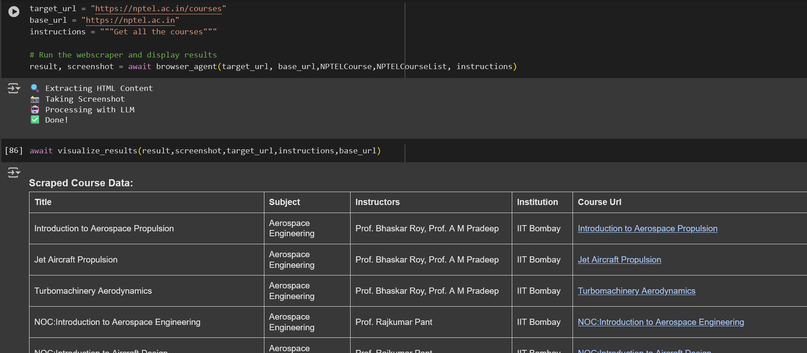
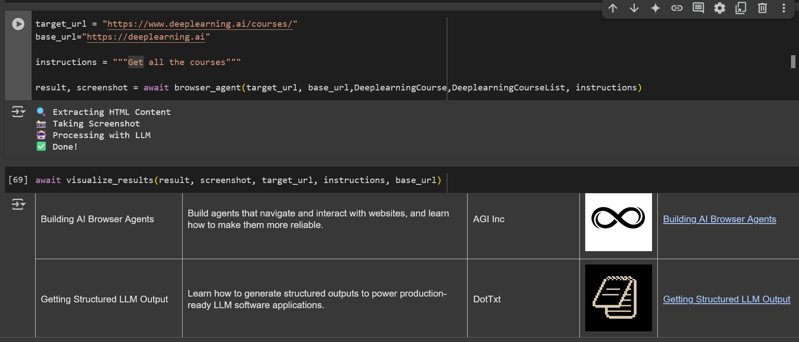
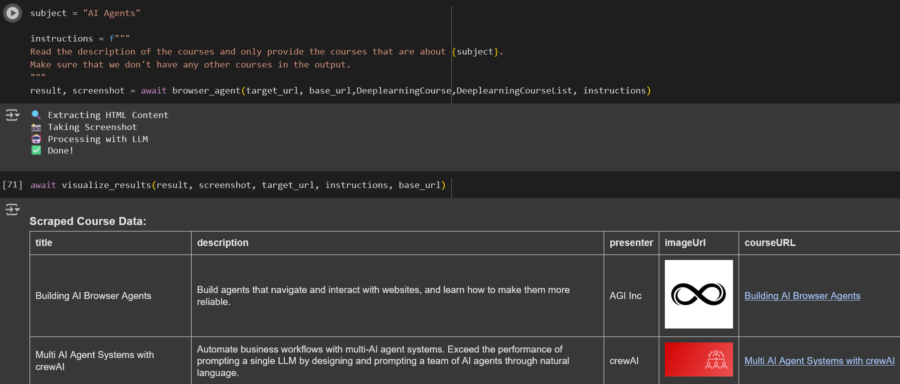

# 🔍 CourseMiner

[](https://www.python.org/downloads/)
[](https://openai.com/)
[](https://opensource.org/licenses/MIT)
[](https://playwright.dev/)
[](https://github.com/smaranjitghose/CourseMiner)

An intelligent web agent that automatically extracts and visualizes course information from educational websites using OpenAI's GPT models.

## 🌟 Features

* 🌐 Automated web scraping of educational platforms
* 🤖 AI-powered content extraction and analysis
* 📊 Dynamic data visualization with interactive tables
* 🔄 Support for multiple educational platforms (NPTEL, DeepLearning.ai, etc.)
* 📸 Automatic screenshot capture of scraped websites
* 🧩 Modular and extensible architecture
* 🔗 Interactive course link generation
* 🖼️ Automatic image extraction
* 📱 Clean data presentation
* 🛠️ Customizable scraping configurations

## 🖼️ Demo

- **Grabbing course data from NPTEL (22nd April, 2025)**


- **Grabbing course data from deeplearning.ai (22nd April, 2025)**


- **Grabbing course data from deeplearning.ai with context (22nd April, 2025)**



## 🔧 Prerequisites

* Python 3.12 or higher
* Jupyter Notebook or Google Colab
* OpenAI API key
* Web Browser

## 📥 Setup

1. Clone the repository:
```bash
git clone https://github.com/smaranjitghose/CourseMiner.git
cd CourseMiner
```

2. Create and activate virtual environment:
```bash
# Windows
python -m venv env
.\env\Scripts\activate
# Linux/Mac
python3 -m venv env
source env/bin/activate
```

3. Install dependencies using requirements.txt:
```bash
pip install -r requirements.txt
```

4. Install Playwright browsers:
```bash
python -m playwright install
```

5. Set up your OpenAI API key in a `.env` file:
```
OPENAI_API_KEY=your-api-key-here
```

## 💡 Usage

1. Launch Jupyter Notebook:
```bash
jupyter notebook
```

2. Open the example notebook:
```
/course_miner.ipynb
```

3. Define Pydantic models for your target website:
```python
# Define the model for individual courses
class CourseModel(BaseModel):
    title: str
    description: str
    instructors: List[str]
    course_url: str
    image_url: str
    
# Define the collection model
class CourseCollection(BaseModel):
    courses: List[CourseModel]
```

4. Update the base URL and target URL in the designated cells:
```python
# Set your target website URLs
base_url = "https://example.edu"
target_url = "https://example.edu/courses"
```

5. Run the browser agent by executing the notebook cells in order

6. View the extracted course information in the interactive visualization table

## 🛠️ Troubleshooting

1. **API Errors**
   - Verify API key validity
   - Check internet connection
   - Confirm API usage limits

2. **Scraping Issues**
   - Ensure website is accessible
   - Check for rate limiting or blocking
   - Adjust wait times for dynamic content

3. **Model Errors**
   - Verify Pydantic model matches website structure
   - Check field names and types
   - Ensure system prompt is properly formatted

## 🤝 Contributing

Contributions are welcome! Please follow these steps:
1. Fork the project
2. Create your feature branch (`git checkout -b feature/AmazingFeature`)
3. Commit your changes (`git commit -m 'Add some AmazingFeature'`)
4. Push to the branch (`git push origin feature/AmazingFeature`)
5. Open a Pull Request

## 📝 License

This project is licensed under the MIT License - see the [LICENSE](LICENSE) file for details.

---
Made with ❤️ by [Smaranjit Ghose](https://github.com/smaranjitghose)
